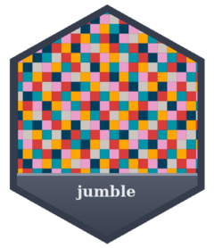

<!-- README.md is generated from README.Rmd. Please edit that file -->

```{r, include = FALSE}
knitr::opts_chunk$set(
  collapse = TRUE,
  comment = "#>",
  fig.path = "man/figures/README-",
  out.width = "100%"
)
```

# jumble 

<!-- badges: start -->
[](https://CRAN.R-project.org/package=jumble)
<!-- badges: end -->

The objective of jumble is to provide a pretty discrete colour palette that is  accessible and colourblind safe. The 7 colours are accessible to normal eyes. The first 5 colours of these are colour-blind safe. The first 3 colours of these are greyscale safe.

## Installation

Install from CRAN, or development version from [GitHub](https://github.com/).
```r
install.packages("jumble") 
pak::pak("davidhodge931/jumble")
```

## Example

```{r example}
library(jumble)
library(scales)
library(dichromat)
library(colorspace)
```

The 7 colours are accessible to normal vision.

```{r}
show_col(jumble)
```

The first 5 colours are colour-blind safe for all forms of colour blindness.

```{r}
show_col(dichromat(colours = jumble, type = "deutan"))
show_col(dichromat(colours = jumble, type = "protan"))
show_col(dichromat(colours = jumble, type = "tritan"))
```

Only the first 3 colours are greyscale safe.

```{r}
show_col(desaturate(jumble))
```

## Other packages

This package is part of a group of related packages built to extend [ggplot2](https://ggplot2.tidyverse.org).

<table><tr>
<td align="center"><a href="https://davidhodge931.github.io/ggblanket/"></a></td>
<td align="center"><a href="https://davidhodge931.github.io/ggrefine/"></a></td>
<td align="center"><a href="https://davidhodge931.github.io/ggscribe/"></a></td>
<td align="center"><a href="https://davidhodge931.github.io/ggwidth/"></a></td>
<td align="center"><a href="https://davidhodge931.github.io/blends/"></a></td>
<td align="center"><a href="https://davidhodge931.github.io/jumble/"></a></td>
</tr></table>
