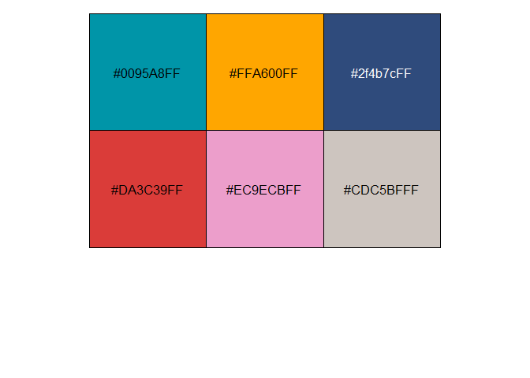
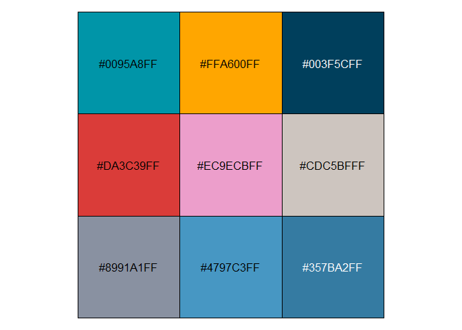

<!-- README.md is generated from README.Rmd. Please edit that file -->

# jumble

<!-- badges: start -->

<!-- badges: end -->

The objective of jumble is to provide a discrete colour palette, as well
as some other useful colours.

## Installation

You can install the development version of jumble from
[GitHub](https://github.com/) with:

``` r
# install.packages("pak")
pak::pak("davidhodge931/jumble")
```

## Example

jumble provides a discrete palette that is relatively colourblind safe.

``` r
library(jumble)
scales::show_col(jumble)
```



``` r
prismatic::check_color_blindness(rev(jumble))
```


It also provides some other colours with accessible names.

``` r
scales::show_col(
  c(teal, orange, navy, red, pink, grey, slate, blue, ocean)
)
```


