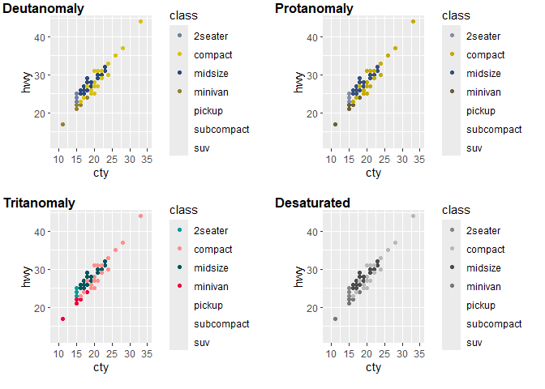
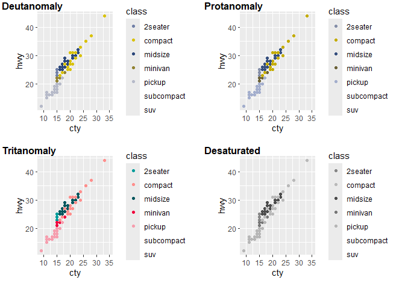
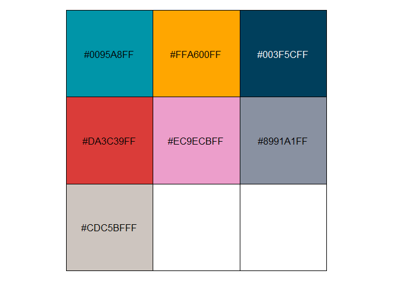

<!-- README.md is generated from README.Rmd. Please edit that file -->

# jumble 

<!-- badges: start -->

[](https://CRAN.R-project.org/package=jumble)
<!-- badges: end -->

The objective of jumble is to provide a discrete colour palette that
looks pretty, but is also relatively colourblind safe.

## Installation

You can install the development version of jumble from
[GitHub](https://github.com/) with:

``` r
# install.packages("pak")
pak::pak("davidhodge931/jumble")
```

## Example

jumble provides a 7 colour discrete colour palette.

``` r
library(ggplot2)
library(jumble)

scales::show_col(jumble)
```


``` r
mpg |> 
  tidyr::drop_na() |> 
  ggplot2::ggplot() +
  geom_point(aes(x = cty, y = hwy, colour = class)) +
  scale_colour_discrete(palette = jumble)
```


The first 4 colours are colour-blind safe for deutanomaly, protanomaly
and tritanomaly.

``` r
p <- mpg |> 
  tidyr::drop_na() |> 
  ggplot2::ggplot() +
  geom_point(aes(x = cty, y = hwy, colour = class)) +
  scale_colour_discrete(palette = jumble[1:4])

colorblindr::cvd_grid(p)
```



The first 5 colours are colour-blind safe for deutanomaly.

``` r
p <- mpg |> 
  tidyr::drop_na() |> 
  ggplot2::ggplot() +
  geom_point(aes(x = cty, y = hwy, colour = class)) +
  scale_colour_discrete(palette = jumble[1:5])

colorblindr::cvd_grid(p)
```



The first 3 colours are desaturated safe.

``` r
p <- mpg |> 
  tidyr::drop_na() |> 
  ggplot2::ggplot() +
  geom_point(aes(x = cty, y = hwy, colour = class)) +
  scale_colour_discrete(palette = jumble[1:5])

colorblindr::cvd_grid(p)
```


The colours within the palette are provided with accessible names.

``` r
scales::show_col(
  c(teal, orange, navy, red, pink, slate, grey)
)
```


